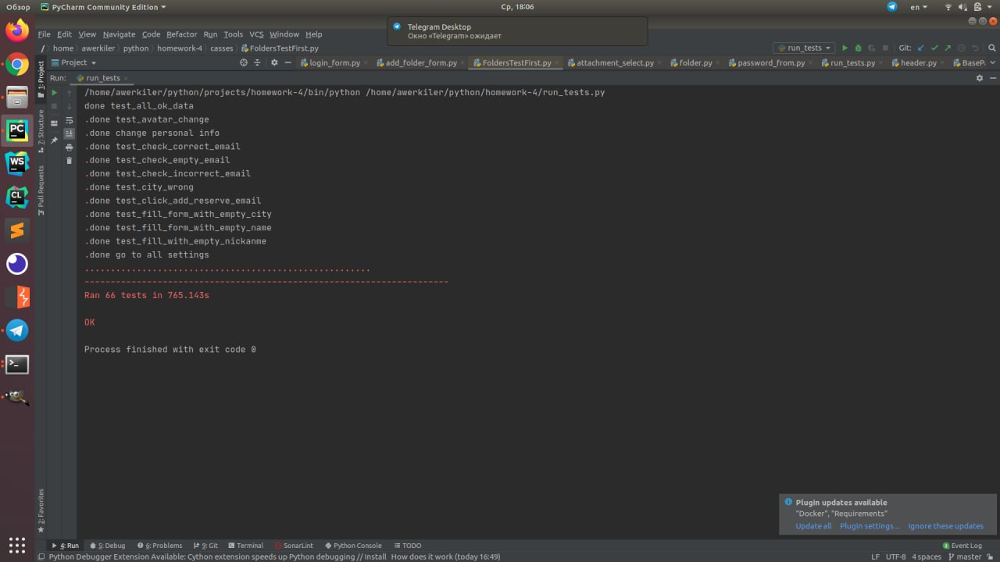

# homework-4 for BMSTU Techpark 3rd semester QA Course

# Запуск

```
$ ./grid.sh
```
```
$ ./node.sh
```
```
$ export BROWSER=<имя браузера> ("CHROME", "FIREFOX")
$ export LOGIN=<логин>
$ export PASSWORD=<пароль>
$ python3 ./run_tests.py
```

# Команда (Github)
- [Дмитрий Гуляченков](https://github.com/EvilBorsch)
- [Александр Аверкиев](https://github.com/Elderly-AI)
- [Андрей Романов](https://github.com/Deiklov)
- [Антон Елагин](https://github.com/AntonElagin)


# Тесткейсы (JIRA)
- [Дмитрий Гуляченков](http://jira.bmstu.cloud/browse/QA-844)
- [Александр Аверкиев](http://jira.bmstu.cloud/browse/QA-845)
- [Андрей Романов](http://jira.bmstu.cloud/browse/QA-846)
- [Антон Елагин](http://jira.bmstu.cloud/browse/QA-843)

# Тесты

