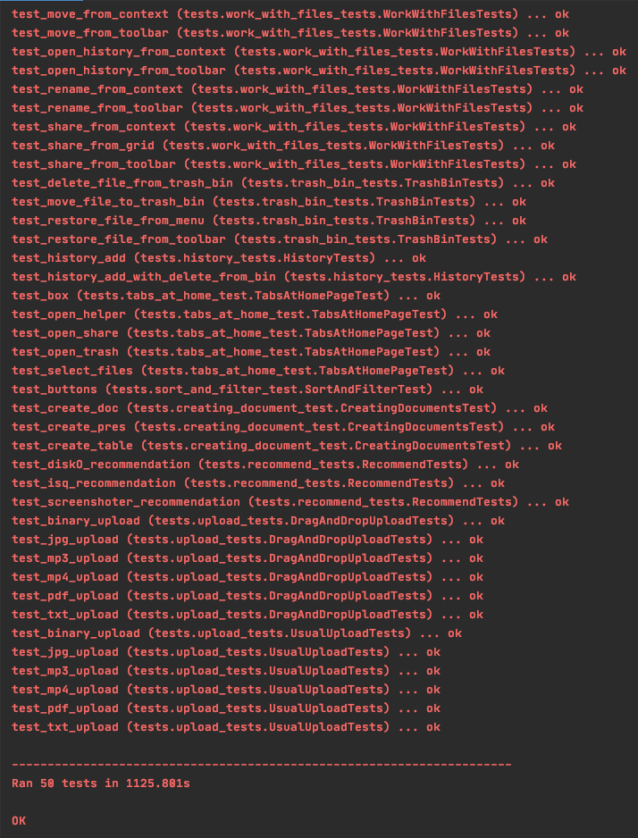
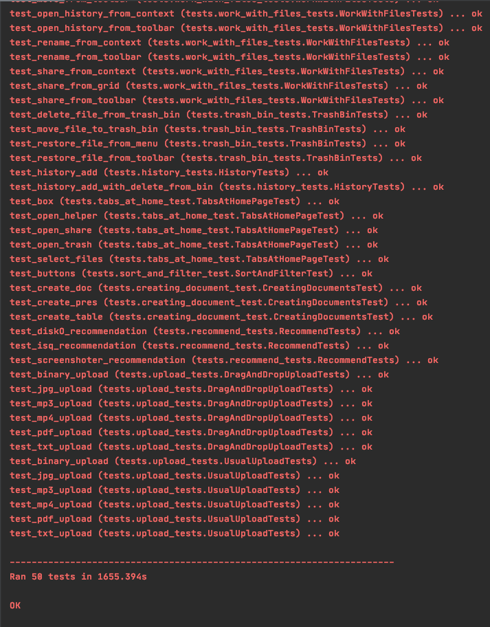

# homework-4 for BMSTU Techpark 3rd semester QA Course

# Запуск

```
$ ./scripts/grid.sh
```
```
$ ./scripts/node.sh
```
```
$ export BROWSER=<имя браузера> ("CHROME", "FIREFOX")
$ export LOGIN=<логин>
$ export PASSWORD=<пароль>
$ python3 ./run_tests.py
```

# Команда (Github)
- [Александр Долгавин](https://github.com/esuwu)
- [Алексей Ершков](https://github.com/alexey-ershkov)
- [Николай Еськов](https://github.com/nickeskov)

# Тесткейсы (JIRA)
- [Александр Долгавин](http://jira.bmstu.cloud/browse/QA-792)
- [Алексей Ершков](http://jira.bmstu.cloud/browse/QA-791)
- [Николай Еськов](http://jira.bmstu.cloud/browse/QA-794)

# Тесты

## CHROME


## FIREFOX


